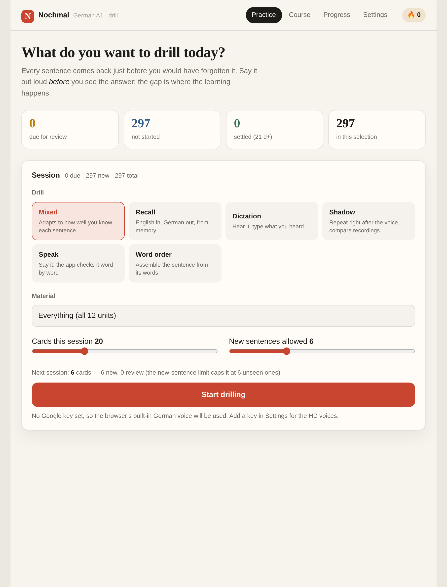
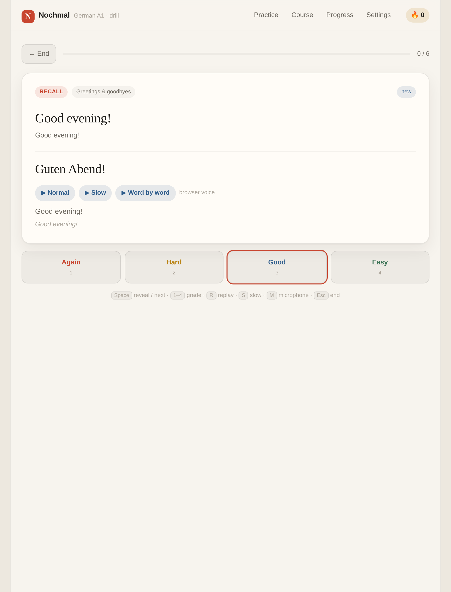
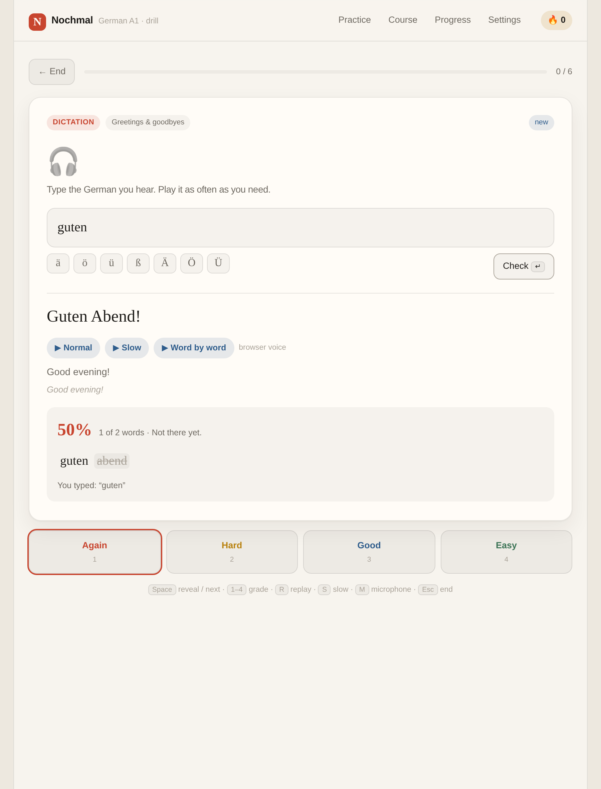
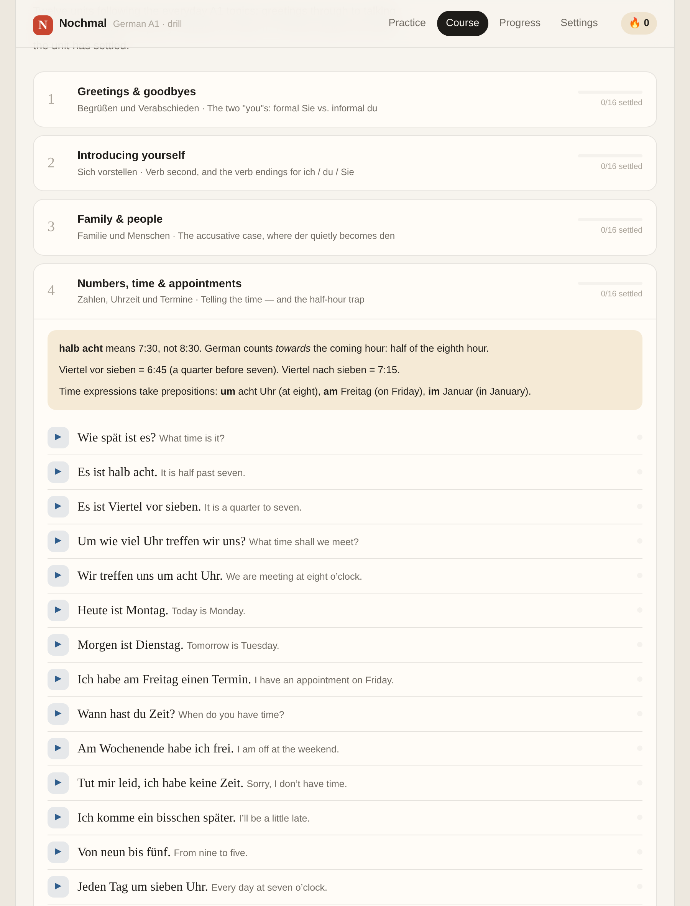
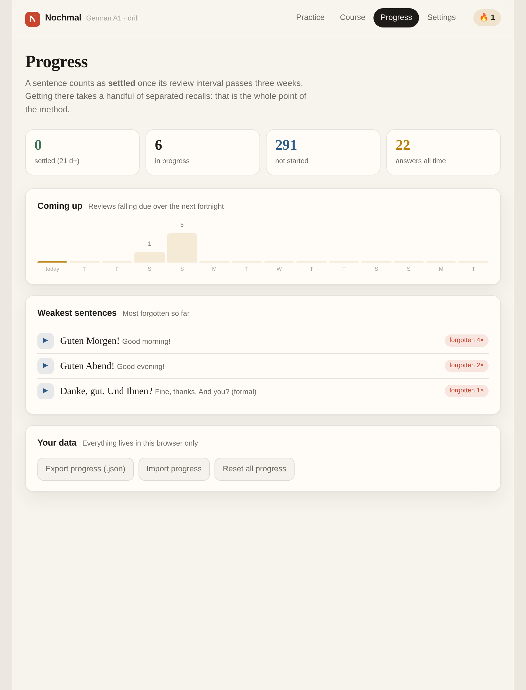
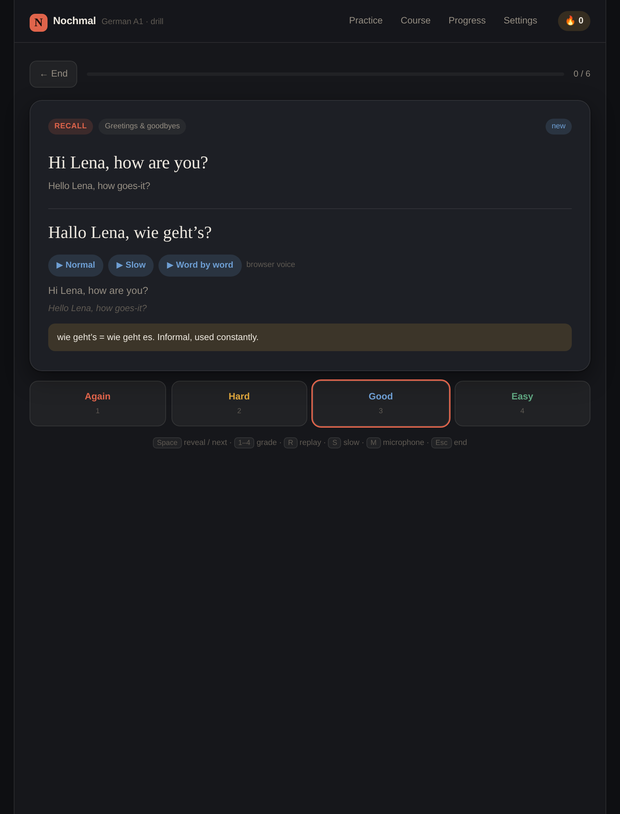

# Nochmal：用英文反覆訓練德文

> 一套A1程度的德文操練App。介面與提示語全用英文，練的是德文：
> 短程用Pimsleur的預期回想，長程用SM-2間隔重複，
> 母語者聲音接Google Cloud Text-to-Speech，口說有逐字回饋。
> 純前端、無後端、無帳號，資料只留在你的瀏覽器。

| 選練習 | 操練中 | 逐字回饋 |
|---|---|---|
|  |  |  |

| 課程與文法 | 進度與預測 | 深色 |
|---|---|---|
|  |  |  |

---

## 這個App在做什麼

市面上的語言App大多在做「辨識」：給你四個選項，你認出正確的那個。
辨識比產出容易得多，所以練起來很順，開口卻還是說不出來。

Nochmal只練產出。每一題都要你**先把德文講出來或打出來，才看得到答案**。
中間那段安靜是刻意的：記憶要在快忘掉的臨界點被取回，才會被強化。

### 兩層循環

**同一次練習裡**：答錯的句子不會被丟到最後，而是隔3題回來，再隔8題、16題。
間隔一次比一次長，逼你在臨界點重新取回。這是Pimsleur的graduated interval recall
（Pimsleur, 1967, *The Modern Language Journal* 51(2)）。

**跨天**：每個句子帶一個ease係數，答對就把間隔乘上去，答錯就打回1天。
間隔會長成1 → 4 → 10 → 25 → 63天。這是SuperMemo的SM-2，也是Anki的底層。
依據是分散練習的後設分析（Cepeda et al., 2006, *Psychological Bulletin* 132(3)）
與提取練習效應（Roediger & Karpicke, 2006, *Psychological Science* 17(3)）。

### 六種操練

| 模式 | 你看到 | 你要做 | 練什麼 |
|---|---|---|---|
| **Mixed** | 依熟練度自動切換 | 視卡片而定 | 新句先拼字，熟了才推到出聲 |
| **Recall** | 英文句 | 在停頓內講出德文 | 產出，預期回想 |
| **Dictation** | 只有聲音 | 打出聽到的德文 | 聽力與拼寫（ß與變音符號嚴格計分） |
| **Shadow** | 只有聲音 | 跟著唸，錄下來A/B比對 | 語調與節奏 |
| **Speak** | 英文句 | 對麥克風講德文 | 發音，逐字對齊回饋 |
| **Word order** | 英文句＋打散的字 | 拼回正確語序 | 德文語序：動詞第二位、可分動詞、句尾動詞 |

「Mixed」是預設值，也是最該用的：沒見過的句子直接叫你回想沒有意義，
所以新句先走Word order把每個字看過一遍，熟了才推到Speak。

---

## 課程內容

12個單元、192個完整句子、105題替換練習，共**297題**。
主題順序照著日常A1的走法：打招呼 → 自我介紹 → 家庭 → 時間 → 飲食 →
餐廳 → 購物 → 租屋 → 問路 → 服飾 → 身體與看醫生 → 談過去。

每個句子有四個欄位：

- **de** 目標德文句
- **en** 英文提示
- **lit** 逐字直譯。`Wie geht es Ihnen?` → *How goes it to-you(formal)?*
  英語母語者最大的障礙是語序與格位，直譯把德文的結構攤開來看。
- **note** 用法陷阱。像是 `halb acht` 是7:30不是8:30、
  `Ich bin voll` 不是「我飽了」而是「我喝醉了」。

每個單元另有文法重點（動詞第二位、格位、可分動詞、Perfekt的haben/sein之分）。

---

## 接上Google文字轉語音

沒有金鑰App也能用，會退回瀏覽器內建的德語語音（通常又平又機械）。
接上Google之後可以用Chirp3 HD與Neural2這一代的聲音，shadowing才有意義。

1. 開 [Google Cloud Console](https://console.cloud.google.com/)，建立或選一個專案。
2. **APIs & Services → Library**，啟用 **Cloud Text-to-Speech API**。
3. **Credentials → Create credentials → API key**。
4. **限制這把金鑰**（重要）：
   - *API restrictions* 只勾Cloud Text-to-Speech API
   - *Application restrictions* 選HTTP referrers，只填你跑這個App的網址
5. 把金鑰貼進App的Settings。

### 為什麼金鑰放在瀏覽器

這是自備金鑰（BYO key）的做法：金鑰存在`localStorage`，只送往
`texttospeech.googleapis.com`，不經過任何第三方。代價是能開這台瀏覽器的人
就看得到金鑰，所以第4步的限制不是選配。要完全不暴露，得自己架一層代理
轉發合成請求：這個App刻意不做，因為那就需要伺服器，也就需要維運。

### 合成結果會快取

反覆訓練的特性是同一句話會被播幾十次。每段音檔依
（句子 × 聲音 × 語速）存進IndexedDB，第二次之後直接從本機拿。
沒有快取的話練十分鐘就是幾百次API呼叫，帳單與延遲都撐不住。

免費額度是每月100萬字元（Standard）／10萬字元（WaveNet、Neural2）。
A1句子大約30–60字元，加上快取，整套297句合成一輪也就一萬多字元。

Settings裡的**Pre-cache**可以在練習前把目前選取範圍的音檔一次備齊，
之後即使離線也能練。

---

## 口說回饋怎麼算的

兩條路，互相補位：

**語音辨識**（Web Speech API，`de-DE`）把你說的話轉文字，跟目標句做
詞層級的Levenshtein對齊，標出哪個字漏掉、哪個唸成了別的字。
只有Chrome／Edge／Safari支援，而且要連網。

**錄音回放**（MediaRecorder）先聽母語者、再聽自己，直接A/B比。
每個瀏覽器都能走，而且對語調與節奏的幫助比分數還大：辨識器只看字，
不管你把重音放在哪裡。

比對前會做正規化：大小寫、標點、阿拉伯數字（`8` → `acht`）都不扣分。
但**打字模式用嚴格比對**，ß與變音符號要算數：那正是拼寫練習的重點。

辨識分數只是參考。辨識器對外國口音本來就嚴格，分數低不一定是你唸錯，
所以評分永遠留在你手上（Again／Hard／Good／Easy四顆按鈕）。

---

## 跑起來

純靜態檔案，沒有建置步驟。

```bash
cd deutsch
python3 -m http.server 8080
# 開 http://localhost:8080
```

**必須用http://開，不要用file://。** 麥克風與語音辨識需要
安全來源（`https` 或 `localhost`），直接雙擊`index.html`會拿不到麥克風。

要放上網的話，把`deutsch/`整個目錄丟到任何靜態主機即可
（GitHub Pages、Netlify、Vercel、Cloudflare Pages）。
記得把該網域加進Google金鑰的HTTP referrer白名單。

---

## 鍵盤

| 鍵 | 動作 |
|---|---|
| `Space` | 揭曉答案／用建議的分數進到下一題 |
| `1` `2` `3` `4` | Again／Hard／Good／Easy |
| `R` | 重播 |
| `S` | 慢速重播 |
| `M` | 開麥克風 |
| `Esc` | 結束這次練習 |

---

## 檔案結構

```
deutsch/
├── index.html          介面骨架
├── style.css           樣式，淺色／深色跟隨系統
├── app.js              主程式：練習流程、六種模式、設定
├── content/
│   └── course.js       12單元課程內容，展平成297題
└── lib/
    ├── scheduler.js    SM-2 ＋ 同場次的graduated interval recall
    ├── tts.js          Google TTS 客戶端 ＋ IndexedDB 音檔快取
    └── speech.js       語音辨識、逐字對齊計分、錄音回放
```

四個模組彼此不相依，各自掛在`window.Nochmal*`底下。用傳統`<script>`
而不是ES module，是為了讓整個目錄複製到任何地方都能直接跑。

---

## 你的資料

沒有帳號、沒有後端、沒有分析追蹤。

- 進度與設定：`localStorage`
- 合成的音檔：`IndexedDB`
- 唯一的對外連線是你自己按下播放時打給Google的合成請求

Progress頁可以把進度匯出成`.json`（金鑰不會被匯出），
也能匯入。匯入是**合併**不是覆蓋：同一句取比較新的那筆，
所以兩台裝置各練一半再合起來不會互相蓋掉。

---

## 內容從哪來

課綱的主題順序參考DW《Nicos Weg》A1的走法，
但**句子全部重寫**：那份影片字幕是自動生成的，全小寫、沒有標點、
辨識錯誤很多（`gut morgen vor schneider`），不能當學習素材。
這裡每一句的拼寫、標點、大小寫都是照標準德文寫的。

## 授權

MIT。課程內容可自由取用改寫。
