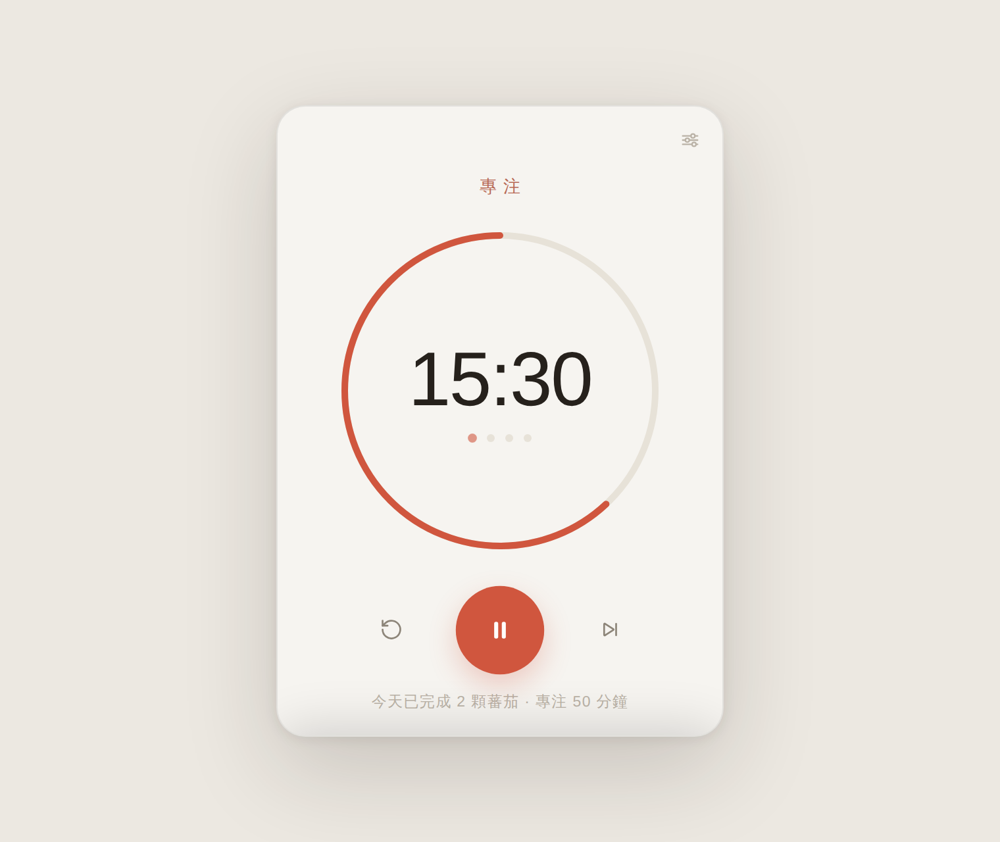
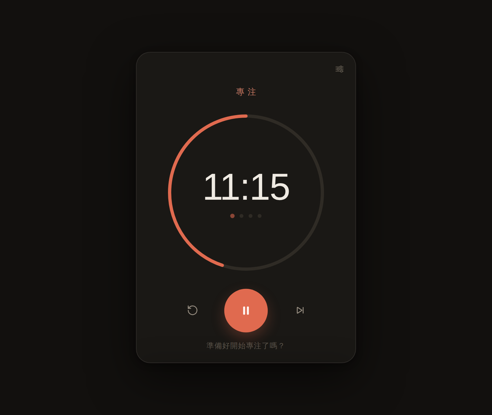

# 蕃茄鐘 🍅

> 簡單、有質感的蕃茄工作法專注工具。macOS 原生 App（Tauri），安裝檔只有幾 MB。

| 淺色 | 深色 |
|---|---|
|  |  |

**線上試用（免安裝）**：<https://claude.ai/code/artifact/9d2da8fe-0ab4-417f-94ae-0101858991e6>

---

## 功能

- **蕃茄工作法循環** — 25 分鐘專注 → 5 分鐘短休息，每 4 輪進入長休息（時長皆可調）
- **選單列即時倒數** — 視窗關掉也照跑，menu bar 直接看剩餘時間、開始／暫停／跳過
- **完成通知＋提示音** — 柔和的雙音提示（合成音，無音檔），桌面通知可獨立開關
- **置頂小視窗** — 一鍵釘選在所有視窗最上層，寫作時掛在角落
- **自動深淺色** — 跟隨系統外觀；三種模式各有專屬色（專注・陶紅／短休息・青綠／長休息・暮藍）
- **今日統計** — 完成幾顆蕃茄、專注幾分鐘，存在本機
- **毛玻璃質感** — 原生 macOS 視窗材質（under-window vibrancy）

### 快捷鍵

| 鍵 | 動作 |
|---|---|
| `空白鍵` | 開始／暫停 |
| `R` | 重設本段 |
| `S` | 跳過這一段 |
| `⌘,` | 設定 |
| `⌘W` | 收進選單列（計時不中斷） |
| `⌘Q` | 結束 |

---

## 安裝到 Mac

### 方式一：下載雲端建置好的安裝檔（免裝任何工具）

1. 到 repo 的 **Actions → Pomodoro macOS build**，點 **Run workflow**（或直接下載最近一次成功執行的產物）
2. 建置約 5–10 分鐘，完成後在該次執行頁面下方 **Artifacts** 下載 `pomodoro-macos`
3. 解壓縮得到 `蕃茄鐘_1.0.0_aarch64.dmg`（Apple Silicon），打開後把 **蕃茄鐘** 拖進 **應用程式**
4. **第一次打開**：因為安裝檔未經 Apple 簽章，macOS 會擋下——
   - 開啟 **系統設定 → 隱私權與安全性**，在下方點 **強制打開**（Open Anyway），之後就正常了
   - 或在終端機執行：`xattr -cr /Applications/蕃茄鐘.app`

> 推 `pomodoro-v*` 格式的 tag（例如 `pomodoro-v1.0.0`）會自動建置並附加到 GitHub Release。

### 方式二：本機建置（不會有安全性警告）

需求與 Strata 桌面版相同（見 [TAURI.md](../TAURI.md)）：Rust、Xcode Command Line Tools、Node 22+。

```bash
cd pomodoro
npm install
npm run build:mac
# 產出：src-tauri/target/release/bundle/dmg/蕃茄鐘_1.0.0_<架構>.dmg
open src-tauri/target/release/bundle/dmg
```

本機建置會自動配對你的晶片架構（Apple Silicon 或 Intel），且沒有 Gatekeeper 警告。

開發模式：`npm run dev`（改前端存檔即重新整理）。

---

## 專案結構

```
pomodoro/
├── ui/                  前端（純 HTML/CSS/JS，無框架、無建置步驟）
│   ├── index.html
│   ├── style.css        色票 token 都在最上方，想換配色改這裡
│   └── app.js           狀態機、計時核心（時間戳計算，休眠喚醒不漂移）
├── src-tauri/           Tauri 外殼（Rust）
│   ├── src/lib.rs       選單列圖示＋倒數、通知、關閉→隱藏、Dock 重開
│   ├── tauri.conf.json  視窗、毛玻璃、打包設定
│   └── icons/           App 圖示（scripts/gen-icons.mjs 以純數學繪製）
└── scripts/gen-icons.mjs 重新產生圖示：npm run icons
```

## 設計

- 暖紙色底、系統字（SF Pro / 蘋方），倒數數字 200 極細字重 + 等寬數字
- 圓環從 12 點鐘方向順時針「消逝」，如同傳統廚房蕃茄鐘
- 提示音為 WebAudio 即時合成的雙音鐘聲：專注結束是下行（放鬆），休息結束是上行（回神）
- 資料（設定與統計）全部存在本機 `localStorage`，沒有任何網路傳輸
