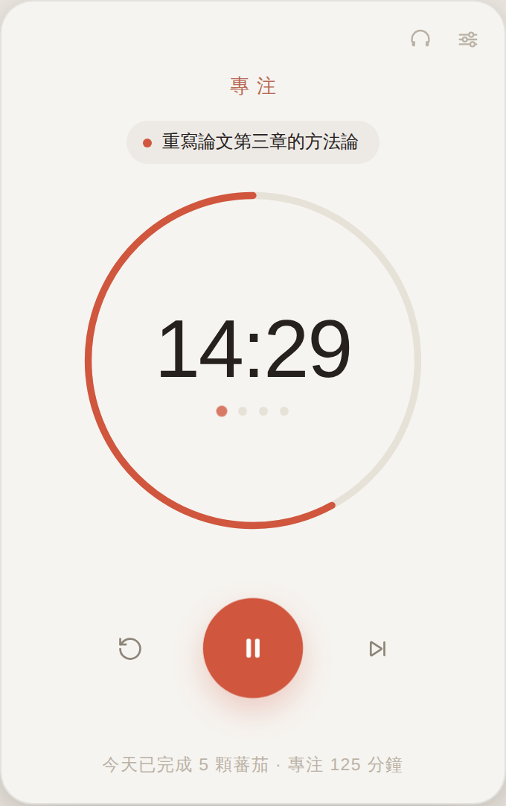
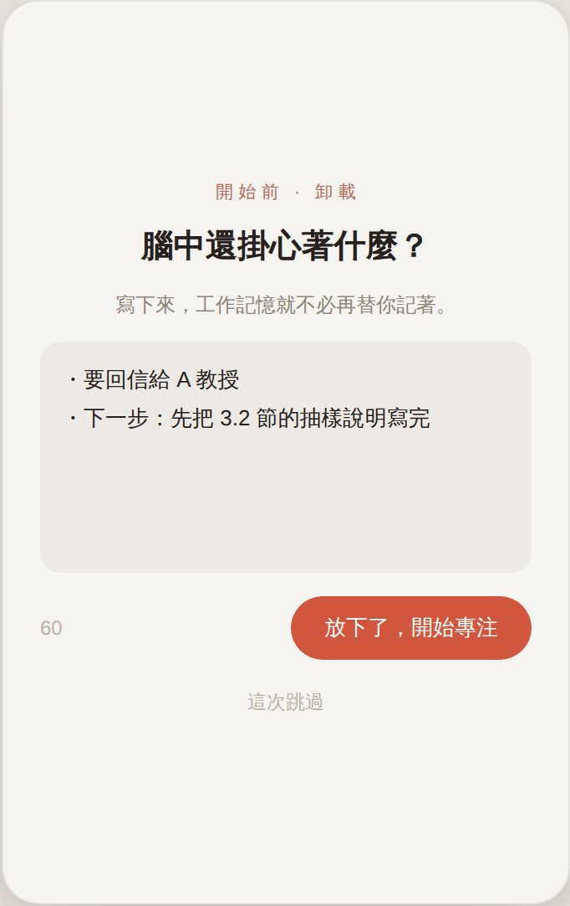
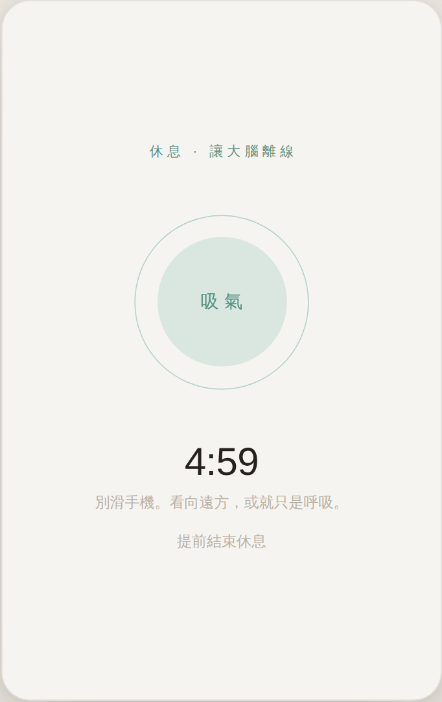
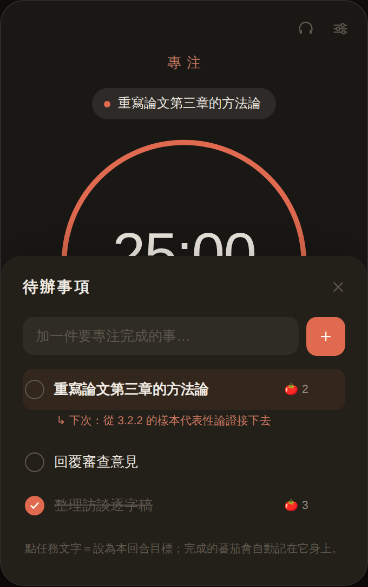
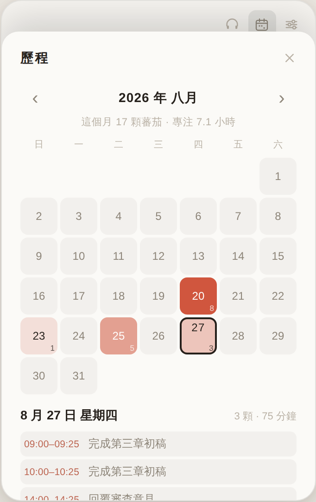
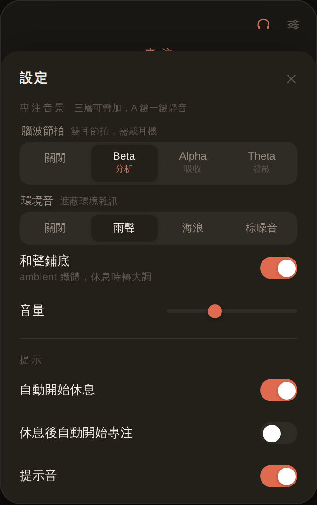

# Flowmato 心流鐘 🍅

> 不只是計時器。依照大腦的神經生物學限制設計：先卸載注意力殘留，再進入專注；
> 休息時鎖定畫面讓 DMN 恢復；用雙耳節拍做神經相位鎖定。
> 每段專注都記進歷程，看得見時間花在哪，也能匯出成日曆檔。
> macOS 原生 App（Tauri，安裝檔 1.9 MB）＋ 免安裝網頁版 ＋ iOS / Android 上架準備完成。

**🌐 網頁版（免安裝，開啟就能用）**：<https://claude.ai/code/artifact/9d2da8fe-0ab4-417f-94ae-0101858991e6>

> GitHub Pages 版（`https://yunching0513.github.io/-/`）已備妥，
> 但需要 repo 擁有者先做一次性啟用，見下方 [開啟 GitHub Pages](#開啟-github-pages)。

| 專注中 | 思緒卸載 | 休息鎖定 |
|---|---|---|
|  |  |  |

| 待辦事項 | 工作歷程 | 設定 |
|---|---|---|
|  |  |  |

---

## 設計原則 → 對應功能

| 神經學原理 | 這個 App 怎麼做 |
|---|---|
| **注意力殘留**（Attention Residue）<br>切換任務後認知表現掉 30–40%；蔡加尼克效應讓未竟之事持續佔用工作記憶 | **思緒卸載盒**：按下開始時先出現 60 秒的卸載畫面，把腦中牽掛寫下來，認知負載外包給檔案。內容留存可隨時回顧 |
| **明確的任務終點**<br>大腦需要「任務結束」訊號，否則背景持續耗運算資源 | **乾淨切斷（Clean Cut）**：每顆蕃茄結束時寫一句「下次從哪裡接續」，存在該任務底下 |
| **超日節律與腺苷代謝**<br>神經元活躍累積腺苷 → 疲勞；休息才能清除並重送葡萄糖 | **蕃茄鐘循環**：25 / 5，每 4 輪長休息 15 分（皆可調） |
| **DMN 與 Alpha 波恢復**<br>休息必須「低認知負荷」才會切到預設模式網絡；滑手機等於沒休息 | **休息鎖定**：休息期間全屏呼吸引導（吸 4s → 屏 2s → 吐 6s），擋住閱讀與操作介面 |
| **神經相位鎖定**<br>大腦振盪會與外部節奏同步；有歌詞的音樂反而搶走專注資源 | **三層音景**（可疊加、各自開關）：<br>① **專注音樂** — Beta 分析／Alpha 吸收／Theta 發散三首樂曲，自動無縫循環（音檔缺席時退回合成的雙耳節拍）<br>② **環境音** — 雨聲／海浪／棕噪音，遮蔽環境雜訊<br>③ **和聲鋪底** — 無旋律的 ambient 織體，專注時小調、休息時轉大調<br>休息時音樂自動切 Alpha |
| **一次只扛一件事**<br>工作記憶容量有限 | **待辦事項**：設定「本回合目標」顯示在計時器上方，完成的蕃茄自動記在該任務身上 |

> **關於「強制」**：卸載盒有 60 秒倒數，但允許提前按「放下了，開始專注」或跳過——
> 強制枯等只會讓人整個關掉這個功能。休息鎖定同理，保留「提前結束休息」。

---

## 功能

- **待辦事項** — 新增／勾選／刪除，點任務文字設為本回合目標；每個任務累計 🍅 數與「下次起點」
- **思緒卸載盒** — 開始前清空工作記憶，內容存在本機可回顧
- **休息鎖定 + 呼吸引導** — 低認知負荷的 DMN 恢復畫面
- **三層音景** — 專注音樂（Beta 分析／Alpha 吸收／Theta 發散三首樂曲，自動無縫循環）＋ 環境音（雨聲／海浪／棕噪音）＋ ambient 和聲鋪底，可任意疊加，`A` 鍵一鍵靜音
- **選單列即時倒數**（macOS App）— 視窗關掉照樣跑，menu bar 直接操作
- **完成通知＋提示音** — 柔和雙音鐘聲，可獨立開關
- **置頂小視窗**（macOS App）— 釘在所有視窗最上層
- **自動深淺色** — 三種模式各有專屬色（專注・陶紅／短休息・青綠／長休息・暮藍）
- **工作歷程** — 月曆檢視每天的專注濃度，點任一天看當天做了什麼、幾點到幾點、投入在哪件事
- **每日待辦** — 可把待辦指定到某一天，在歷程頁直接規劃與勾選
- **匯出到日曆** — 一鍵產生 `.ics`，每段專注是一個日曆事件，可匯入 Google／Apple／Outlook
- **今日統計** — 完成幾顆蕃茄、專注幾分鐘
- **資料只存在本機** — `localStorage`，零網路傳輸、零帳號

### 快捷鍵

| 鍵 | 動作 |
|---|---|
| `空白鍵` | 開始／暫停 |
| `T` | 待辦事項 |
| `J` | 工作歷程 |
| `A` | 音景靜音／恢復 |
| `R` | 重設本段 |
| `S` | 跳過這一段 |
| `⌘,` | 設定 |
| `Esc` | 關閉面板 |
| `⌘W` | 收進選單列（App，計時不中斷） |

---

## 使用方式

### 1. 網頁版（最快）

<https://claude.ai/code/artifact/9d2da8fe-0ab4-417f-94ae-0101858991e6> —— 開啟即用，手機也可以。資料存在該瀏覽器。

#### 開啟 GitHub Pages

想要 `github.io` 的公開網址，需要 repo 擁有者做一次性設定
（GitHub Actions 的預設權限無法自行開啟 Pages）：

1. **Settings → Pages**
2. **Build and deployment → Source** 選 **GitHub Actions**
3. **Actions → [Pomodoro web (GitHub Pages)](https://github.com/yunching0513/-/actions/workflows/pomodoro-pages.yml) → Run workflow**

之後每次 `pomodoro/ui/` 有變更就會自動重新部署到
`https://yunching0513.github.io/-/`。

### 2. 下載 macOS 安裝檔

1. 到 **Actions → [Pomodoro macOS build](https://github.com/yunching0513/-/actions/workflows/pomodoro-build.yml)**，
   點最近一次成功的執行，在下方 **Artifacts** 下載 `pomodoro-macos`
2. 解壓縮得到 `Flowmato_1.0.0_aarch64.dmg`（Apple Silicon），打開拖進 **應用程式**
3. **第一次打開**：安裝檔未經 Apple 簽章，macOS 會擋——
   - **系統設定 → 隱私權與安全性** → 點 **強制打開**
   - 或終端機執行 `xattr -cr /Applications/Flowmato.app`

> 推 `pomodoro-v*` tag（如 `pomodoro-v1.0.0`）會自動建置並附加到 GitHub Release。

### 3. iOS / Android

雙平台的專案設定、圖示、商店素材與建置 CI 都已備妥，
剩下需要開發者帳號與簽章的步驟見 **[docs/PUBLISHING.md](docs/PUBLISHING.md)**。

行動版與桌面版共用同一份 `ui/`，但有幾處針對手機調整：
安全區域避開瀏海、觸控目標放大到 44px 以上、覆蓋層改為不透明，
以及**進入背景前預先排程本地通知**——手機在背景會凍結 JS，
計時器不能靠前景迴圈觸發（回到前景時以時間戳重算，所以時間永遠是準的）。

### 4. 本機建置（無安全性警告）

需要 Rust、Xcode Command Line Tools、Node 22+。

```bash
cd pomodoro
npm install
npm run build:mac
open src-tauri/target/release/bundle/dmg
```

開發模式：`npm run dev`。

> **注意**：直接用瀏覽器開啟 `ui/index.html`（`file://`）時，瀏覽器的 CORS 政策會擋掉音檔載入，
> 音樂層會自動退回合成音。要聽到音樂請用 App、GitHub Pages，或在 `ui/` 起一個本地伺服器
> （`python3 -m http.server`）。

---

## 專案結構

```
pomodoro/
├── ui/                   前端（純 HTML/CSS/JS，無框架、無建置步驟）
│   ├── index.html
│   ├── style.css         色票 token 都在最上方，想換配色改這裡
│   ├── app.js            狀態機、計時核心、待辦、音訊引擎
│   ├── journal.js        工作歷程：月曆、當日紀錄、.ics 匯出
│   ├── audio/            三首專注樂曲（MP3，App 內建，離線可用）
│   └── privacy.html      隱私權政策（商店要求的公開頁面）
├── src-tauri/            Tauri 外殼（Rust）
│   ├── src/lib.rs        選單列倒數、通知、關閉→隱藏、Dock 重開
│   ├── tauri.conf.json   視窗、毛玻璃、打包設定
│   └── icons/            App 圖示（以純數學 SDF 繪製）
├── scripts/
│   ├── icon-lib.mjs      圖示繪圖引擎（SDF 數學繪製，自行編碼 PNG/ICNS/ICO）
│   ├── gen-icons.mjs     產生全平台圖示：npm run icons
│   └── store/            商店素材的 HTML 模板
├── store/                上架素材（圖示、截圖、功能圖片、文案）
└── docs/
    ├── PUBLISHING.md     App Store / Play 上架逐步指南
    └── music-prompts.md  用專業 AI 服務生成背景音樂的 prompt 包
```

同一份 `ui/` 同時是網頁版與 App 內容：`window.__TAURI__` 存在時切換成原生視窗樣式（毛玻璃、置頂、選單列）。

## 技術細節

- **計時用時間戳而非累加**，電腦休眠喚醒後不會漂移
- **雙耳節拍**：`ChannelMerger` 左右耳各一個 `OscillatorNode`，差頻即腦波頻率
- **環境音**：4 秒噪音 buffer 循環播放（首尾交叉淡化消除接縫），白噪音經 bandpass 成雨聲、棕噪音（積分白噪音）經 lowpass 成海浪，海浪另有 0.07 Hz LFO 同時推動截止頻率與音量做出潮汐起落
- **和聲鋪底**：每個和弦音兩支微失諧（±4 cents）振盪器產生自然 chorus，低通截止由 0.045 Hz LFO 緩慢推動形成呼吸感
- **音層切換**：舊層淡出與新層淡入重疊即為 crossfade；音量以 `setTargetAtTime` 平滑跟隨
- **音樂的無縫循環**：三首曲子只有 3–4 分鐘，25 分鐘的專注要循環 6–8 次。素材本身有淡入淡出
  （實測 alpha 淡入 6s、三首都有約 5–7s 淡出），直接 `loop=true` 每輪會出現一段幾乎全靜音的空白
  （實測凹陷 164 dB）。改為跳過素材自身的淡入淡出、相鄰兩輪以等功率 sin/cos 曲線交叉淡化 4 秒，
  接縫凹陷降到 7.9 dB（已在音樂本身的動態範圍內）。以 `OfflineAudioContext` 渲染跨接縫音訊驗證
- **音檔格式選 MP3 而非 AAC/Opus**：macOS App 用的是 WKWebView，Linux 的 WebKitGTK 依賴系統
  codec，AAC 與 Opus 都可能缺（實測開源 Chromium 就不支援 AAC）。MP3 是唯一全引擎通吃的
- **提示音**：WebAudio 即時合成的雙音鐘聲——專注結束下行（放鬆），休息結束上行（回神）
- **圖示**：`gen-icons.mjs` 用 SDF 數學繪製並自行編碼 PNG / ICNS / ICO，無圖檔、無相依套件
- **日期一律用本地時間切分**：`toISOString()` 取的是 UTC，在 UTC+8 會把凌晨到早上 8 點算成前一天
- **`.ics` 自行產生**：符合 RFC 5545 的折行（75 octets，中文 3 bytes 很容易超過）與字元轉義，
  已用 `icalendar` 解析器驗證過 19 個事件、UID 唯一、長中文標題折行後可完整還原

## 尚未實作

原始構想中另外兩項需要「閱讀器本體」才能成立，不在這個專注工具的範圍內：

- **動態難度微調（4% 挑戰）** — 需要載入書籍內容、WPM 測試與引導光標
- **平坦聯想筆記／角色扮演濾鏡** — 需要文本、筆記庫與 AI 概念降維

若要往閱讀器發展，這個計時器可以直接當作它的專注引擎。
